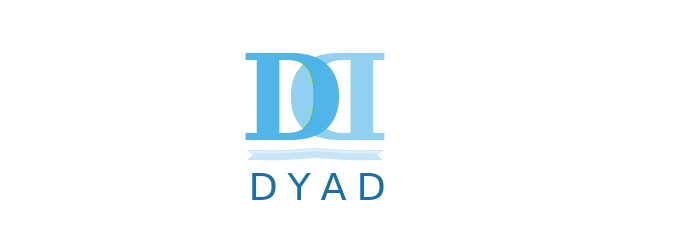

<p align="center">
  <!-- Mother Project Logo on the Left -->
  
  <!-- Your Project Name in the Middle -->
  <span style="font-size: 2.2em; font-weight: bold; margin: 0 20px; valign: middle;">DYAD: DYnamic and Asynchronous Data Streamliner</span>
  
  <!-- Your Subproject Logo on the Right -->
  
</p>

---

DYAD aims to facilitate data file sharing between producer and consumer job elements, particularly within an ensemble or across co-scheduled ensembles.

DYAD delivers this functionality through two components: a FLUX module that provides the service and a set of I/O wrappers for client-side integration.

DYAD transparently synchronizes file access at the file level (rather than the byte level) between producers and consumers, and manages data transfer from the producer’s location to the consumer’s location.

Users simply access files via paths located under the directory managed by the DYAD service.

### Documentation
For further information, build and refer to the documentation under `docs` or the online copy at [readthedocs](https://dyad.readthedocs.io/en/latest/index.html).

```
cd docs
python3 -m venv .venv
source .venv/bin/activate
pip install --upgrade pip
pip install -r requirements.txt
make html
make pdf
```
Then, open `index.html` under `_build/html` or DYAD.pdf under `_build/pdf`


### License

SPDX-License-Identifier: LGPL-3.0

LLNL-CODE-764420


### Information on the license of the external projects on which this project depends

- MURMUR3 - License and contributing - All this code is in the public domain. Murmur3 was created by Austin Appleby, and the C port and general tidying up was done by Peter Scott. If you'd like to contribute something, I would love to add your name to this list.

- LIBB64 - License: This work is released into the Public Domain. It basically boils down to this: I put this work in the public domain, and you can take it and do whatever you want with it. An example of this "license" is the Creative Commons Public Domain License, a copy of which can be found in the LICENSE file in the distribution, and also on-line at http://creativecommons.org/licenses/publicdomain/
