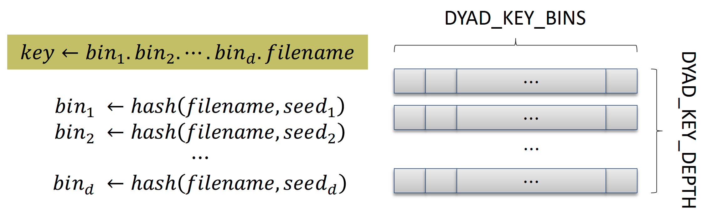

## DYAD dependencies
- requires: [flux-core](https://github.com/flux-framework/flux-core.git), [jansson](https://github.com/akheron/jansson.git)
- optional: [mochi-margo](https://github.com/mochi-hpc/mochi-margo.git) for using libfabric
            [ucx](https://github.com/openucx/ucx.git) for using ucx
            [dftracer](https://github.com/llnl/dftracer.git), numpy and h5py for performance tracing

Also, we recommend to install [flux-sched](https://github.com/flux-framework/flux-sched.git)
For this tutorial, we already have these dependencies pre-installed.


## In case of installing dependencies using [spack](https://github.com/spack/spack.git)

```
git clone https://github.com/spack/spack.git
spack env create dyad
spack env activate dyad
spack external find
spack compiler find
spack install --add ucx
spack install --add mochi-margo
spack load mochi-margo
# spack env deactivate
```

pip install flux-python==0.80.0

## Setup the environment
```
export DYAD_INSTALL_PREFIX=/home/${USER}/venv
module load flux-core mochi-margo
# Or
# spack env activate dyad
# spack load mochi-margo
```

## Build DYAD

```
git clone https://github.com/flux-framework/dyad.git
cd dyad; mkdir build; cd build
cmake -DDYAD_ENABLE_MARGO_DATA=ON \
      -DDYAD_LIBDIR_AS_LIB=ON \
      -DCMAKE_INSTALL_PREFIX=${DYAD_INSTALL_PREFIX} \
      ..
make -j install
cd ../docs/demos/SCA26
make
cd ../../..
```

To enable DYAD with Python, set up PyDYAD in a virtual environment.

```
python3 -m venv ${DYAD_INSTALL_PREFIX}
source ${DYAD_INSTALL_PREFIX}/bin/activate
pip install flux-python==0.80.0
cd pydyad
pip install .
```


## Producer-Consumer example with DYAD
In this example, we use two simple implementations of a producer and a consumer
written in C: [prod.c](../ecp_feb_2023/prod.c) and [cons.c](../ecp_feb_2023/cons.c). Each program accepts two command-line arguments.

For the producer, the arguments specify the number of files to write and the 
directory into which the files are written. For the consumer, the arguments
specify the number of files to read and the directory from which the files are
read.

To improve I/O performance, we create the directory on the local SSD of each
node. If the directory is configured as a DYAD-managed directory (DMD), DYAD
intercepts file read and write operations and transparently transfers files
between nodes as needed.

The consumer opens the files it needs to read as if they already exist on its
local storage. If a requested file does not exist locally, DYAD pauses the file
open operation until the producer writes the file to its local storage (which 
is remote to the consumer). DYAD then creates a local copy for the consumer,
after which the read operation resumes normally.

If a file access is not within a DMD, DYAD does not intervene and allows the
operation to proceed without interference.

```
+------------------------+            +------------------------+
|                        |            |                        |
|    Producer Process    |            |    Consumer Process    |
|                        |            |                        |
+------------------------+            +------------------------+
|     Local Storage      | -- File -> |     Local Storage      |
| /mnt/ssd/${USER}/dyad  |            | /mnt/ssd/${USER}/dyad  |
+------------------------+            +------------------------+
      Compute Node 1                        Compute Node 2
```

### Walk through the example step by step using two terminals, starting by setting the required environment variables.

Open two terminals connected to the login node, and ensure that the `flux-core`
module is loaded in both sessions. One terminal will be used for the producer
and the other for the consumer.

Set the environment variables on both terminals that need to be replicated
across all compute nodes in the allocation. Unless a Flux proxy is used, this
step can be deferred until starting the Flux instance. This is because Flux
captures and propagates the current environment to the resources it begins to
manage when the instance is started.

Especially, DYAD requires four environment variables, **DYAD_KVS_NAMESPACE**, **DYAD_DTL_MODE**, **DYAD_PATH_PRODUCER** and **DYAD_PATH_CONSUMER**.

```
export DYAD_KVS_NAMESPACE=dyad
export DYAD_DTL_MODE=MARGO
```
Other data transfer layer (DTL) choices include `UCX` and `FLUX_RPC`.

**The DYAD Managed Directory (DMD)** 

Although it is possible to set different DMDs for the producer and the consumer,
we typically use the same directory for both to keep file paths consistent.

```
export DYAD_PATH_PRODUCER=/mnt/ssd/${USER}/dyad
export DYAD_PATH_CONSUMER=/mnt/ssd/${USER}/dyad
```

For the full list of DYAD environment variables, refer to [dyad_envs.h](../../../include/dyad/common/dyad_envs.h).
- DYAD_PATH_RELATIVE: The presence of this variable in the environment indicates that DYAD treats relative paths as relative to the managed directory.
- DYAD_SHARED_STORAGE: The presence of this variable in the environment indicates that the storage containing the managed path is shared. In this case, DYAD does not transfer files but only synchronizes access.
- DYAD_ASYNC_PUBLISH: Enable asynchronous metadata publishing by producers.
- DYAD_SERVICE_MUX: Number of Flux brokers sharing node-local storage. The default is 1.
- DYAD_KEY_BINS: DYAD utilizes a hierarchical key structure with multiple levels of hash tables. This variable specifies the number of hash bins at each level. The default is 1024.
- DYAD_KEY_DEPTH: This variable specifies the number of hash table levels. The default is 3.




### Allocate compute nodes and start a Flux instance

In one terminal, allocate compute nodes—two nodes in this example, with one core
per node. Ensure that the `mochi-margo` module is loaded to take advantage of
the underlying high-speed interconnect. On systems where the native scheduler
is SLRUM, use [salloc](https://slurm.schedmd.com/salloc.html) command. On systems where Flux is the native scheduler,
use the [flux alloc](https://flux-framework.readthedocs.io/projects/flux-core/en/latest/man1/flux-alloc.html) command.

The `salloc` command below returns an interactive shell on a compute node, from
which you can start a Flux instance. When using `flux alloc`, a sub-instance is
started automatically, so no additional step is required.

```
$ salloc -N 2 -n 2 --tasks-per-node=1 -t 30
salloc: Granted job allocation 70
```


[Start a Flux instance](https://flux-framework.readthedocs.io/projects/flux-core/en/latest/guide/start.html) using the allocated resources (two nodes in this example).
The [srun](https://slurm.schedmd.com/srun.html) option `--pty` returns an interactive shell on the first compute node.
It is recommended to use `--mpi=pmi2` when bootstrapping Flux.
For running OpenMPI v5+ under Flux, refer to [flux-pmix](https://github.com/flux-framework/flux-pmix).

```
$ srun --mpi=pmi2 -N 2 -n 2 --pty flux start # -v -o,-S,log-filename=out.txt
```

Verify the nodes managed by the Flux instance using [`flux exec`](https://flux-framework.readthedocs.io/projects/flux-core/en/latest/man1/flux-exec.html).

```
$ flux exec -r all hostname
dsaicn01
dsaicn02
```

### Set up a Flux proxy in the second terminal for interactive demonstration

Switch to the second terminal to connect to the second compute node through the
*Flux proxy*. In this terminal, first run [`squeue`](https://slurm.schedmd.com/squeue.html) to obtain the ID of the SLURM
allocation (job) in which the Flux instance is running.

```
$ squeue
             JOBID PARTITION     NAME     USER ST       TIME  NODES NODELIST(REASON)
                70   compute interact    yeom2  R       1:38      2 dsaicn[01-02]
```

Then, set up a Flux proxy to connect to the existing instance under that
allocation using the commands, [flux uri](https://flux-framework.readthedocs.io/projects/flux-core/en/latest/man1/flux-uri.html) and [flux proxy](https://flux-framework.readthedocs.io/projects/flux-core/en/latest/man1/flux-proxy.html).

```
$ flux proxy `flux uri slurm:70`
$ flux exec -r all hostname
dsaicn01
dsaicn02
```

### Start DYAD service

Switch back to the first terminal, which has a shell on the first compute node.
**Create a DYAD namespace** in the Flux key-value-store (KVS) using the [flux kvs](https://flux-framework.readthedocs.io/projects/flux-core/en/latest/man1/flux-kvs.html) command.

```
flux kvs namespace create ${DYAD_KVS_NAMESPACE}
```

The namespace will be visible to all nodes managed by the Flux instance,
allowing you to verify its existence from another terminal.

```
flux kvs namespace list
```

Flux maintains job-related information using a hierarchical key-value store (KVS) in a scalable manner
DYAD leverages this capability while isolating data using namespaces.


Start the DYAD service by loading the DYAD Flux plugin module into the Flux instance.

```
flux exec -r all flux module load ${DYAD_INSTALL_PREFIX}/lib/dyad.so \
                      --mode="${DYAD_DTL_MODE}" ${DYAD_PATH_PRODUCER}
```
The DYAD module can be configured using environment variables, and users can
override these settings through command-line arguments. Therefore, specifying
both module arguments may not have been necessary in this example.

For this particular example, we only need to load the DYAD module on the node
where the producer is running. However, it is generally a good practice to make 
it available on all nodes if they are expected to produce files to be shared.
That is why we execute [flux module load](https://flux-framework.readthedocs.io/projects/flux-core/en/latest/man1/flux-module.html) on all the Flux broker ranks.
The DYAD module `dyad.so` requires an argument to specify the DYAD Managed Directory (DMD).
In this case, it is `${DYAD_PATH_PRODUCER}`.


### Run the consumer and producer on separate nodes using local storage

For demonstration purposes, start the consumer first on one of the nodes (e.g., dsaicn01).
When it attempts to open a file that does not yet exist, the operation blocks
until the file becomes locally available. If the producer were started first,
the consumer would complete without blocking.

```
cd interactive
flux exec -r 0 ./c_cons.sh
```
Where `c_cons.sh` contains the following:
```
mkdir -m 775 -p ${DYAD_PATH_CONSUMER}/prod-cons
LD_PRELOAD=${DYAD_INSTALL_PREFIX}/lib/libdyad_wrapper.so ../c_cons 10 ${DYAD_PATH_CONSUMERER}/proc-cons
```
./c_cons is the executable build out of [cons.c](../ecp_feb_2023/cons.c).
The DYAD wrapper library `libdyad_wrapper.so` leverages the LD_PRELOAD mechanism
to intercept *open()/close()* and *fopen()/fclose()* calls on files under the DMD.
It then performs DYAD-specific operations on those file accesses.
In particular, when the consumer reads a file, metadata discovery and file
transfer are triggered during the *open()/fopen()* operation.


On the other terminal, run the producer:
```
cd interactive
flux exec -r 1 ./c_prod.sh
```
where `c_prod.sh` is as contains the following:
```
LD_PRELOAD=${DYAD_INSTALL_PREFIX}/lib/libdyad_wrapper.so ../c_prod 10 ${DYAD_PATH_PRODUCER}/prod-cons
```
./c_prod is the executable build out of [prod.c](../ecp_feb_2023/prod.c).
When the producer writes a file, DYAD intercepts the *close()/fclose()* calls to
publish metadata in the form of a key-value pair consisting of the file path
and the owner broker rank.

You will see that the consumer completes.
For further inspection, you can check the files on the local storage of each node.

```
flux exec -r 0 ls -l ${DYAD_PATH_CONSUMER}/prod-cons
flux exec -r 1 ls -l ${DYAD_PATH_PRODUCER}/prod-cons
```

### Clean up

```
flux exec -r 0 rm -rf ${DYAD_PATH_CONSUMER}/prod-cons
flux exec -r 1 rm -rf ${DYAD_PATH_PRODUCER}/prod-cons
flux kvs namespace remove dyad
flux exec -r all flux module remove dyad
```

Finally, `exit` both the proxy terminal and the compute-node shell, or remain in
them to run the next example.


## Runing a workflow in a batch processing mode

As the number of workflow tasks scales, manually coordinating tasks becomes
increasingly difficult. Consequently, task jobs are typically submitted to a
batch scheduler such as SLURM or Flux. Without DYAD, it is necessary to
explicitly specify dependencies between consumer and producer task jobs. In
addition, data are most often shared through a global shared file system rather
than through node-local storage. DYAD relaxes these scheduling constraints and
exposes new opportunities for scheduling optimization.


## Deep learning training with DYAD

In this demonstration, we use the UNet3D example from the Deep Learning I/O ([DLIO](https://dlio-benchmark.readthedocs.io/en/latest/)) Benchmark.
In deep learning (DL) training, the stochastic gradient descent (SGD) algorithm
relies on sample shuffling. In distributed training, the entire dataset may
reside on shared storage accessible to all trainers. However, this approach can
introduce bottlenecks due to concentrated metadata lookups and saturated
bandwidth. Alternatively, the dataset can be sharded across compute nodes,
provided there is a mechanism to make locally stored samples accessible to
remote nodes. DYAD transparently fulfills this requirement and significantly
improves I/O performance. In this setup, each trainer acts as both a consumer
and a producer. DYAD first checks whether a sample exists in the cache; if not,
the sample is loaded from shared storage.


### Install the DLIO benchmark in a Python virtual environment

If possible, use the same environment as PyDYAD.

```
module load flux-core mochi-margo mpich
export DYAD_INSTALL_PREFIX=/home/${USER}/venv
source ${DYAD_INSTALL_PREFIX}/bin/activate

git clone https://github.com/argonne-lcf/dlio_benchmark
cd dlio_benchmark
# comment out nvidia-dali-cuda in setup.py
pip install .[dftracer]
pip install flux-python==0.80.0
```

### Set up the environment to use DLIO, DFTracer and DYAD

```
module load flux-core mochi-margo mpich
export DYAD_INSTALL_PREFIX=/home/${USER}/venv
source ${DYAD_INSTALL_PREFIX}/bin/activate
export LD_LIBRARY_PATH=${LD_LIBRARY_PATH}:${HOME}/venv/lib
export DFTRACER_ENABLE=1
export DYAD_KVS_NAMESPACE=dyad
export DYAD_DTL_MODE=MARGO
export DYAD_PATH_PRODUCER=/mnt/ssd/${USER}/dyad
export DYAD_PATH_CONSUMER=/mnt/ssd/${USER}/dyad
mkdir -p ${HOME}/demo_DLIO
export PYTHONPATH=${HOME}/demo_DLIO:$PYTHONPATH
export TEST_FILE_SIZE=33554432
export TEST_NUM_FILES=6400
```
Copy `dyad/docs/demos/SCA26/DL/dyad_torch_data_loader.py` into `${HOME}/demo_DLIO`

Alllocate compute nodes and start a Flux instance

```
salloc -N 4 -n 128 --tasks-per-node=32 -t 60
source ${HOME}/new_venv/bin/activate
srun --mpi=pmi2 -N 4 -n 4 --pty flux start # -v -o,-S,log-filename=out.txt
flux kvs namespace create ${DYAD_KVS_NAMESPACE}
flux exec -r all flux module load ${DYAD_INSTALL_PREFIX}/lib/dyad.so
flux exec -r all rm -rf ${DYAD_PATH_PRODUCER}
flux exec -r all mkdir -p ${DYAD_PATH_PRODUCER}
```

### Generate Training Data

```
export DLIO_LOG_LEVEL=info;
flux run -N 4 -n 128 dlio_benchmark \
  workload=unet3d_a100 \
  ++workload.workflow.generate_data=True \
  ++workload.workflow.train=False \
  hydra.run.dir=${HOME}/demo_DLIO/output \
  ++workload.output.folder=${HOME}/demo_DLIO/output \
  ++workload.dataset.num_files_train=${TEST_NUM_FILES} \
  ++workload.dataset.record_length_bytes=${TEST_FILE_SIZE} \
  ++workload.dataset.record_length_bytes_stdev=0 \
  ++workload.dataset.data_folder=${HOME}/demo_DLIO/dataset \
  ++workload.checkpoint.checkpoint_folder=${HOME}/demo_DLIO/checkpoint
```

### Train without DYAD

```
flux run -N 4 -n 128 dlio_benchmark \
  workload=unet3d_a100 \
  ++workload.workflow.generate_data=False \
  ++workload.workflow.train=True \
  hydra.run.dir=${HOME}/demo_DLIO/output \
  ++workload.output.folder=${HOME}/demo_DLIO/output  \
  ++workload.dataset.num_files_train=${TEST_NUM_FILES} \
  ++workload.dataset.record_length_bytes=${TEST_FILE_SIZE} \
  ++workload.dataset.record_length_bytes_stdev=0 \
  ++workload.dataset.data_folder=${HOME}/demo_DLIO/dataset \
  ++workload.checkpoint.checkpoint_folder=${HOME}/demo_DLIO/checkpoint \
  ++workload.reader.batch_size=1 \
  ++workload.train.epochs=20 \
  ++workload.train.computation_time=0
```

### Train with DYAD

```
flux run -N 4 -n 128 dlio_benchmark \
  workload=unet3d_a100 \
  ++workload.workflow.generate_data=False \
  ++workload.workflow.train=True \
  hydra.run.dir=${HOME}/demo_DLIO/output \
  ++workload.output.folder=${HOME}/demo_DLIO/output  \
  ++workload.dataset.num_files_train=${TEST_NUM_FILES} \
  ++workload.dataset.record_length_bytes=${TEST_FILE_SIZE} \
  ++workload.dataset.record_length_bytes_stdev=0 \
  ++workload.dataset.data_folder=${HOME}/demo_DLIO/dataset \
  ++workload.checkpoint.checkpoint_folder=${HOME}/demo_DLIO/checkpoint \
  ++workload.reader.batch_size=1 \
  ++workload.train.epochs=20 \
  ++workload.train.computation_time=0 \
  ++workload.reader.multiprocessing_context=fork \
  ++workload.reader.data_loader_classname=dyad_torch_data_loader.DyadTorchDataLoader \
  ++workload.reader.data_loader_sampler=index
```
