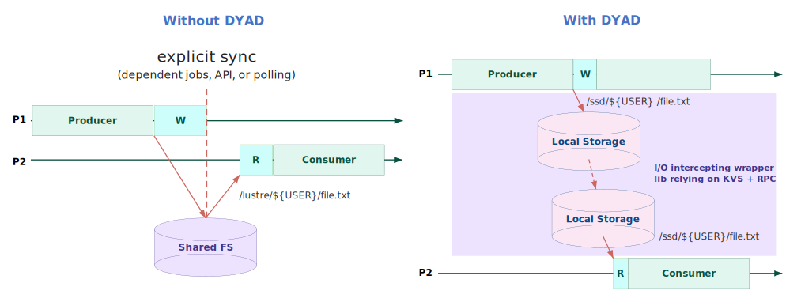

.. _DYAD_desig:

******************************
DYAD System Design
******************************

.. _DYAD_useful:

Where is DYAD useful?
#####################

A producer and consumer scenario sharing a file
===============================================

   Without DYAD, producer and consumer share data via a shared file system
   (e.g., Lustre) with explicit synchronization through dependent jobs, APIs,
   or polling. With DYAD, they use node-local storage with the abstraction of
   shared visibility. DYAD transparently intercepts I/O and transfers data
   across local storages while coordinating accesses through KVS and
   RDMA-based data movement, eliminating both the shared file system
   bottleneck and the need for explicit synchronization.

   Check out our use case with a molecular dynamics simulation workflow
   :ref:`Lumsden et al. 2024 <paper-ipdpsw-2024>`.

Deep Learning Training by Distributed Stochastic Gradient Descent (SGD)
=======================================================================

Deep learning training often requires randomizing the order of input samples at
each epoch. In distributed or parallel training, where each worker processes a
subset of the samples, the set of files assigned to each worker changes at every
epoch due to this randomization.

With DYAD, workers can avoid repeatedly loading files from shared storage at
every epoch. Instead, workers can retrieve files from the local storage of other
workers when needed. Initially, the dataset is partitioned across workers. When
a file is reference for the first time, it is staged into the DYAD managed
directory on the local storage of the worker who owns the partition.

Check out our use case with the `DLIO <https://dlio-benchmark.readthedocs.io/en/latest/>`_ 
representing PyTorch dataloader :ref:`Devarajan et al. 2024 <paper-sbacpad-2024>`.

.. include:: _fragments/design_overview.rst

.. include:: _fragments/design_dtl.rst

.. include:: _fragments/design_lookup.rst

.. include:: _fragments/design_local_access.rst

.. include:: _fragments/design_init.rst

